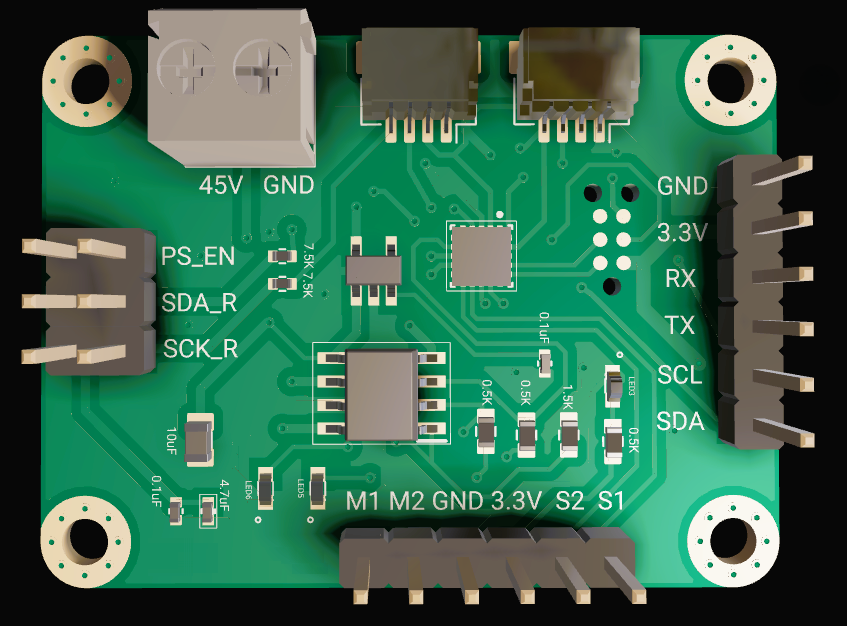

# Smart Encoder Motor Driver

  

## PCB Assembly Video

---

The **Smart Encoder Motor Driver** is a compact, closed-loop motor controller designed for DC motors equipped with magnetic or optical encoders. It integrates a high-frequency PID feedback controller and a full H-bridge on a single board, enabling precise, autonomous motor control in response to simple commands from a host device. Built around the **STM32C0 microcontroller**, it is well-suited for robotics, automation, and any application requiring reliable, high-precision motion control.

---

## Firmware

The main firmware source file is located [here](https://github.com/egeozgul/Servo-Motor-Feedback-Controller/tree/main/SourceCode/Src).

---

## Key Features

- **Closed-Loop PID Control** — High-frequency feedback loop for precise, stable motor operation.
- **Trapezoidal Trajectory Planner** — Generates smooth motion profiles with controlled acceleration and deceleration, eliminating mechanical shock and overshoot.
- **ASCII Command Interface** — Set target positions, tune PID gains, query torque feedback, and more over a simple serial protocol.
- **Wide Voltage Range** — Operates from 5 V to 45 V.
- **Current Capacity** — Up to 4.1 A continuous.
- **Dual Communication** — Supports both I2C and UART protocols.
- **Daisy-Chain Expansion** — Qwiic connectors allow up to 112 units on a single I2C bus (the maximum supported by the 7-bit I2C standard). Further scaling is possible through software-based addressing schemes.

---

## Trapezoidal Trajectory Planner

The embedded trajectory generator computes a motion profile based on the target position, velocity, and acceleration constraints. Rather than commanding raw PWM duty cycles, the host simply specifies a destination; the controller handles the rest.

**Benefits:**
- Smooth transitions with no abrupt starts or stops
- Eliminates overshoot and oscillation
- Fully configurable velocity, acceleration, and deceleration limits

### Motion Profile

The plots below were captured using the custom live UART plotter and show a representative motion sequence:

1. **Position**
2. **Velocity**
3. **Motor current draw**

---

## Custom Live Plotter

A browser-based UART plotter is included for real-time monitoring of motor state.

🔗 [Open Live UART Plotter](https://egeozgul.github.io/live-uart/)

It supports an unlimited number of simultaneously plotted variables with customizable colors and labels — no installation required.

---

## Final PCB Design

  

  

---

## Connectivity and Expansion

The driver uses **Qwiic connectors** for tool-free daisy-chaining. Up to **112 units** can be connected on a single I2C bus using standard 7-bit addressing. For larger systems, software-based addressing extends this further, making the platform well-suited for multi-axis robotics and large-scale automation.

---

## Repository Contents

| Folder / File | Description |
|---|---|
| `SourceCode/` | STM32 firmware (C) |
| `gerber_files/` | PCB manufacturing files |
| `docs/` | Schematics and design documentation |
| `schematic.png` | Circuit schematic |
| `pcb_.png` | PCB render |
| `assembly.mp4` | PCB assembly walkthrough |

---

## License

This project is open-source under the **MIT License**. You are free to use, modify, and distribute it for any purpose.
